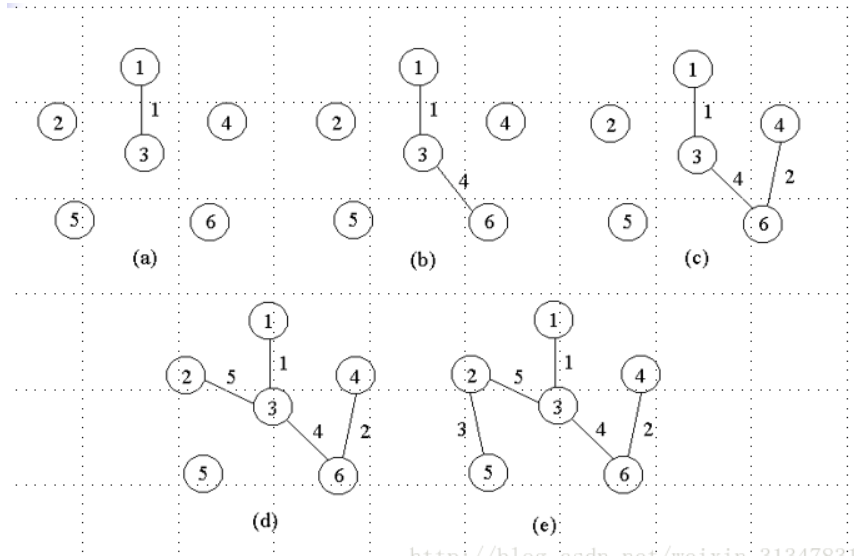
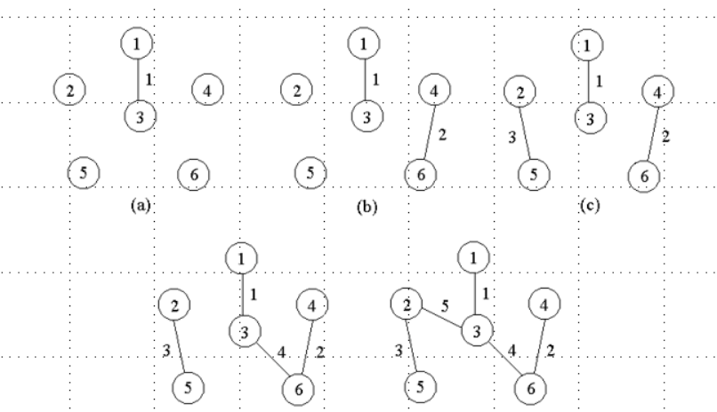

# FangJiaFuXi
shifoushangchuan
55555
333
# 终版 第一章
例. 求正整数m、n的最大公因数。
```C
Euclid(int m, int n)
{ int r;
while(n!=0)
{ r=m%n;
m=n;
n=r;
}
printf(“%d”, m)
}
```
（5）模板template ：
```C
template <class Type>
Type max(Type x,Type y)
{
return x>y?x:y;
} 
int i=max(1,2)；
double x=max(1.0,2.0)；
```
例：顺序搜索算法
```C
template<class Type>
int seqSearch(Type *a, int n, Type k)
{
for(int i=0;i<n;i++)
if (a[i]==k) return i;
return -1;
}
```
递归算法复杂性分析
```C
int factorial(int n)
{
 if (n == 0) return 1; 
 return n*factorial(n-1);
}
```
.png)
# **第2章 递归与分治策略**
通过实例学习分治策略设计技巧。 
```  
（1）二分搜索技术
（2）大整数乘法
（3）Strassen矩阵乘法
（4）棋盘覆盖
（5）合并排序和快速排序
（6）线性时间选择
（7）最接近点对问题
（8）循环赛日程表
```
第n个Fibonacci数可递归地计算如下：
```C
int fibonacci(int n)
{
if (n <= 1) return 1;
return fibonacci(n-1)+fibonacci(n-2);
}
```


```C
template<class Type>
void Perm(Type list[], int k, int m )
    { //产生[list[k:m]的所有排列
    if(k==m)
        { //只剩下一个元素
        for (int i=0;i<=m;i++) 
        cout<<list[i];
        cout<<endl;
        }
    else //还有多个元素待排列，递归产生排列
        for (int i=k; i<=m; i++)
        {
        swap(list[k],list[i]);
        Perm(list,k+1,m); 
        swap(list[k],list[i]); 
     } 
}
```
<div style="border: 2px solid black; display: inline-block; padding: 10px;">
  
  
</div>


  
```C
int equationCount(int n,int m)
{
    if(n<1||m<1)
        return 0;
    if(n==1||m==1)
        return 1;
    else if(n<m)
        return equationCount(n,n);
    else if(n==m)
        return 1+equationCount(n,n-1);
    else
        return equationCount(n,m-1)+equationCount(n-m,m);
}
```
  

  
```C
void hanoi(int n,int a,int b ,int c)
{
    if(n>0)
    {
        hanoi(n-1,z,c,b);
        move(a,b);
        hanoi(n-1,c,b,a);
    }
}
```


**二分搜索算法：**
```C
template<class Type> 
int BinarySearch(Type a[], const Type& x, int l, int r)
{
    while (r >= l)
    { 
        int m = (l+r)/2;
        if (x == a[m]) return m;
        if (x < a[m]) r = m-1; else l = m+1;
    }
return -1;
}
```
# **第三章**
通过应用范例学习动态规划算法设计策略。
```
① 矩阵连乘问题；
② 最长公共子序列；
③ 最大子段和
④ 凸多边形最优三角剖分；
⑤ 多边形游戏；
⑥ 电路布线；
⑦ 流水作业调度；
⑧ 0-1背包问题；
⑨ 最优二叉搜索树  
```
# **复习**
  **编程或算法实现重点在：最大字段和，最优装载、0-1背包问题、最长公共子序列、活动安排问题、棋盘覆盖、多边形游戏 （1）活动安排问题；（2）最优装载问题；（3）单源最短路径；（4）最小生成树；**
  
## 棋盘覆盖


```C
void chessBoard(int tr, int tc, int dr, int dc, int size) 
{
    // tr, tc 为棋盘左上角方格的行列号
    // dr, dc 为特殊方格的位置（行号、列号）
    // size 为当前棋盘的大小
  
    // 基本情况：当棋盘的大小为1时，不再进行分割，直接返回
    if (size == 1) return;
  
    // 定义一个 L 型骨牌编号 t，和棋盘分割的大小 s
    int t = tile++,  // 使用递增的 t 值作为 L 型骨牌编号
        s = size / 2;  // 分割棋盘，将棋盘分成 4 个子棋盘
  
    // 覆盖左上角的子棋盘
    if (dr < tr + s && dc < tc + s)
        // 如果特殊方格在左上角的子棋盘中
        chessBoard(tr, tc, dr, dc, s);  // 递归处理左上角子棋盘
    else {
        // 如果特殊方格不在左上角子棋盘中
        board[tr + s - 1][tc + s - 1] = t;  // 使用 t 号 L 型骨牌覆盖左下角的特殊方格
        // 递归覆盖其他区域
        chessBoard(tr, tc, tr + s - 1, tc + s - 1, s);
    }
  
    // 覆盖右上角的子棋盘
    if (dr < tr + s && dc >= tc + s)
        // 如果特殊方格在右上角的子棋盘中
        chessBoard(tr, tc + s, dr, dc, s);  // 递归处理右上角子棋盘
    else {
        // 如果特殊方格不在右上角子棋盘中
        board[tr + s - 1][tc + s] = t;  // 使用 t 号 L 型骨牌覆盖右上角的特殊方格
        // 递归覆盖其他区域
        chessBoard(tr, tc + s, tr + s - 1, tc + s, s);
    }
  
    // 覆盖左下角的子棋盘
    if (dr >= tr + s && dc < tc + s)
        // 如果特殊方格在左下角的子棋盘中
        chessBoard(tr + s, tc, dr, dc, s);  // 递归处理左下角子棋盘
    else {
        // 如果特殊方格不在左下角子棋盘中
        board[tr + s][tc + s - 1] = t;  // 使用 t 号 L 型骨牌覆盖左下角的特殊方格
        // 递归覆盖其他区域
        chessBoard(tr + s, tc, tr + s, tc + s - 1, s);
    }
  
    // 覆盖右下角的子棋盘
    if (dr >= tr + s && dc >= tc + s)
        // 如果特殊方格在右下角的子棋盘中
        chessBoard(tr + s, tc + s, dr, dc, s);  // 递归处理右下角子棋盘
    else {
        // 如果特殊方格不在右下角子棋盘中
        board[tr + s][tc + s] = t;  // 使用 t 号 L 型骨牌覆盖右下角的特殊方格
        // 递归覆盖其他区域
        chessBoard(tr + s, tc + s, tr + s, tc + s, s);
    }
}
```

## 最长公共子序列


```C
void chessBoard(int tr, int tc, int dr, int dc, int size) 
{
    // tr, tc 为棋盘左上角方格的行列号
    // dr, dc 为特殊方格的位置（行号、列号）
    // size 为当前棋盘的大小
  
    // 基本情况：当棋盘的大小为1时，不再进行分割，直接返回
    if (size == 1) return;
  
    // 定义一个 L 型骨牌编号 t，和棋盘分割的大小 s
    int t = tile++,  // 使用递增的 t 值作为 L 型骨牌编号
        s = size / 2;  // 分割棋盘，将棋盘分成 4 个子棋盘
  
    // 覆盖左上角的子棋盘
    if (dr < tr + s && dc < tc + s)
        // 如果特殊方格在左上角的子棋盘中
        chessBoard(tr, tc, dr, dc, s);  // 递归处理左上角子棋盘
    else {
        // 如果特殊方格不在左上角子棋盘中
        board[tr + s - 1][tc + s - 1] = t;  // 使用 t 号 L 型骨牌覆盖左下角的特殊方格
        // 递归覆盖其他区域
        chessBoard(tr, tc, tr + s - 1, tc + s - 1, s);
    }
  
    // 覆盖右上角的子棋盘
    if (dr < tr + s && dc >= tc + s)
        // 如果特殊方格在右上角的子棋盘中
        chessBoard(tr, tc + s, dr, dc, s);  // 递归处理右上角子棋盘
    else {
        // 如果特殊方格不在右上角子棋盘中
        board[tr + s - 1][tc + s] = t;  // 使用 t 号 L 型骨牌覆盖右上角的特殊方格
        // 递归覆盖其他区域
        chessBoard(tr, tc + s, tr + s - 1, tc + s, s);
    }
  
    // 覆盖左下角的子棋盘
    if (dr >= tr + s && dc < tc + s)
        // 如果特殊方格在左下角的子棋盘中
        chessBoard(tr + s, tc, dr, dc, s);  // 递归处理左下角子棋盘
    else {
        // 如果特殊方格不在左下角子棋盘中
        board[tr + s][tc + s - 1] = t;  // 使用 t 号 L 型骨牌覆盖左下角的特殊方格
        // 递归覆盖其他区域
        chessBoard(tr + s, tc, tr + s, tc + s - 1, s);
    }
  
    // 覆盖右下角的子棋盘
    if (dr >= tr + s && dc >= tc + s)
        // 如果特殊方格在右下角的子棋盘中
        chessBoard(tr + s, tc + s, dr, dc, s);  // 递归处理右下角子棋盘
    else {
        // 如果特殊方格不在右下角子棋盘中
        board[tr + s][tc + s] = t;  // 使用 t 号 L 型骨牌覆盖右下角的特殊方格
        // 递归覆盖其他区域
        chessBoard(tr + s, tc + s, tr + s, tc + s, s);
    }
}
  
```
## 多边形游戏


构造递归函数
由上分析可知，为了求链合并的最大值，必须同时求子链合并的最大值和最小值。因此，在整个计算过程中，应同时计算最大值和最小值。


```C
void Min_Max(int n, int i, int s, int j, int &minf, int &maxf, int m[][n][2], char op[]) {
    int e[4];  // 用于存储不同计算的临时结果
  
    // 计算顶点 r
    int r = (i + s - 1) % n + 1;
  
    // 获取 p(i, s) 和 p(i+s, j-s) 的结果
    int a = m[i][s][0], b = m[i][s][1];   // p(i, s)
    int c = m[r][j - s][0], d = m[r][j - s][1]; // p(i+s, j-s)
  
    // 判断当前操作符是加法还是乘法
    if (op[r] == '+') {
        // 如果是加法，直接将最小值和最大值相加
        minf = a + c;
        maxf = b + d;
    } else {
        // 如果是乘法，计算可能的乘法结果
        e[1] = a * c;
        e[2] = a * d;
        e[3] = b * c;
        e[4] = b * d;
  
        // 初始化 minf 和 maxf 为 e[1]（即 a * c）
        minf = maxf = e[1];
  
        // 遍历剩余的计算结果，更新 minf 和 maxf
        for (int r = 2; r < 5; r++) {
            if (minf > e[r]) minf = e[r]; // 更新最小值
            if (maxf < e[r]) maxf = e[r]; // 更新最大值
        }
    }
}
```
  
```C
int Poly_Max(int n) {
    int minf, maxf;
  
    // 遍历所有可能的链长度 j 和子链起始点 i
    for (int j = 2; j <= n; j++) {
        for (int i = 1; i <= n; i++) {
            for (int s = 1; s < j; s++) {
                // 计算链长为 j 的最小值和最大值
                Min_Max(n, i, s, j, minf, maxf, m, op);
  
                // 更新 m[i][j] 的最小值和最大值
                if (m[i][j][0] > minf) m[i][j][0] = minf;
                if (m[i][j][1] < maxf) m[i][j][1] = maxf;
            }
        }
    }
  
    // 找到从顶点 1 开始的最大值
    int temp = m[1][n][1];
    for (int i = 1; i <= n; i++) {
        if (temp < m[i][n][1]) temp = m[i][n][1];
    }
  
    return temp;
}
```
## 0-1背包问题


```C
// 0/1 背包问题的动态规划解法
  
template< class Type >
void Knapsack(Type *v, int *w, int c, int n, Type **m) {
    // 计算背包剩余容量的最大值，确保 j <= jMax < c
    int jMax = min(w[n] - 1, c);
  
    // 初始化背包容量小于第n个物品重量时，背包中不能装下该物品
    for (int j = 0; j <= jMax; j++)  
        m[n][j] = 0;
  
    // 对于背包容量大于等于第n个物品重量时，背包的价值等于该物品的价值
    for (int j = w[n]; j <= c; j++)  
        m[n][j] = v[n];
  
    // 从第n-1个物品开始逐步更新最大价值
    for (int i = n - 1; i > 1; i--) {
        jMax = min(w[i] - 1, c);  // 背包容量小于当前物品重量时，不能选择该物品
        for (int j = 0; j <= jMax; j++)  // 背包容量小于第i个物品重量时，背包的最大价值等于不选第i个物品的价值
            m[i][j] = m[i + 1][j];
  
        for (int j = w[i]; j <= c; j++) {  // 背包容量大于等于物品重量时，可以选择该物品
            // 选择当前物品与否，更新最大价值
            m[i][j] = max(m[i + 1][j], m[i + 1][j - w[i]] + v[i]);
        }
    }
  
    // 最后处理第1个物品
    m[1][c] = m[2][c];
    if (c >= w[1])
        m[1][c] = max(m[1][c], m[2][c - w[1]] + v[1]);
}
  
// 回溯函数，用于追踪最优解中哪些物品被选中
template <class Type>
void Traceback(Type **m, int *w, int c, int n, int x[]) {
    // 从第1个物品开始回溯，逐一确定物品是否被选中
    for (int i = 1; i < n; i++) {
        // 如果当前背包容量没有改变，则第i个物品没有被选中
        if (m[i][c] == m[i + 1][c])  
            x[i] = 0;  // 物品i没有被选中
        else {  // 如果背包容量改变了，则第i个物品被选中
            x[i] = 1;  // 物品i被选中
            c = c - w[i];  // 更新背包剩余容量
        }
    }
  
    // 最后处理第n个物品的选择情况
    x[n] = (m[n][c]) ? 1 : 0;  // 如果m[n][c]不为0，则表示第n个物品被选中
}
  
```
## 装载问题

```C
// 模板类，用于处理任意类型的数据（如整型、浮点型）
template <class Type>
class Loading
{
    // 声明友元函数，方便直接访问私有成员
    friend Type MaxLoading(Type w[], Type c, int n);
private:
    // 回溯函数，用于递归搜索
    void Backtrack(int i);
    // 集装箱数量
    int n;
    // 指向集装箱重量数组的指针
    Type *w;
    // 容器最大承重量
    Type c;
    // 当前装载重量（已经选择的集装箱总重量）
    Type cw;
    // 当前找到的最大装载重量
    Type bestw;
    // 剩余未考察的集装箱总重量
    Type r;
};
// 回溯函数的实现
template <class Type>
void Loading<Type>::Backtrack(int i)
{
    // 如果当前已考察完所有的集装箱（递归结束条件）
    if (i > n)
    {
        // 如果当前装载重量超过已有最大值，更新最优解
        if (cw > bestw)
            bestw = cw;
        return; // 返回上一层
    }
    // 减去当前集装箱重量，更新剩余未考察重量
    r -= w[i];
    // 尝试选中当前集装箱（左子树搜索）
    if (cw + w[i] <= c) // 如果选择当前集装箱不会超出容器容量
    {
        cw += w[i]; // 更新当前装载重量
        Backtrack(i + 1); // 递归考察下一个集装箱
        cw -= w[i]; // 回溯：撤销选择当前集装箱
    }
    // 尝试不选当前集装箱（右子树搜索）
    if (cw + r > bestw) // 剪枝条件：剩余重量有可能超过当前最优值
    {
        Backtrack(i + 1); // 递归考察下一个集装箱
    }
    // 回溯：恢复剩余未考察重量
    r += w[i];
}
// 最大装载重量的入口函数
template <class Type>
Type MaxLoading(Type w[], Type c, int n)
{
    // 定义一个 Loading 类的对象
    Loading<Type> X;
    // 初始化成员变量
    X.w = w;       // 集装箱重量数组
    X.c = c;       // 容器最大承重量
    X.n = n;       // 集装箱数量
    X.bestw = 0;   // 最优解初始化为 0
    X.cw = 0;      // 当前装载重量初始化为 0
    X.r = 0;       // 剩余未考察重量初始化为 0
    // 计算所有集装箱的总重量（用于初始化剩余重量 r）
    for (int i = 1; i <= n; i++)
        X.r += w[i];
    // 调用回溯函数，从第一个集装箱开始
    X.Backtrack(1);
    // 返回找到的最大装载重量
    return X.bestw;
}
  
```
## 做题练习
**算法设计方法总结**
---
### **1. 贪心法（Greedy Algorithm）**
- **原理**：每一步都选择当前最优解，期望最终结果是最优解。
- **适用问题**：最优子结构问题，即局部最优能导出全局最优。
  - 如：活动安排选择、最小生成树（Prim、Kruskal）、霍夫曼编码。
- **时间复杂度**：依问题而定，常为 \( O(n \log n) \) 或 \( O(n) \)。
- **例子**：找零问题，按面值从大到小选硬币。

---

### **2. 动态规划（Dynamic Programming, DP）**
- **原理**：将问题分解为子问题，记录每个子问题的解，避免重复计算。自底向上。
- **适用问题**：重叠子问题、最优子结构。
  - 如：0/1背包问题（也是分支界限。不是贪心，背包是贪心）、*最长公共子序列（LCS）*、矩阵链乘法、Fibonacci数列。
- **时间复杂度**：\( O(n^2) \) 或 \( O(n \cdot W) \)，依问题而定。
- **例子**：爬楼梯问题，每步可走1级或2级，计算总走法。

---

### **3. 分治法（Divide and Conquer）**
- **原理**：将问题分成独立的子问题，递归解决，最后合并结果。
- **适用问题**：可以分割成独立子问题，且合并成本低。
  - 如：归并排序、快速排序、*二分搜索*、最近点对问题。
  *棋盘覆盖问题，选择问题，循环赛日程表，归并排序 。（0/1背包问题不行）*
- **时间复杂度**：\( O(n \log n) \) 或 \( O(n) \)，依合并过程而定。
- **例子**：归并排序，将数组不断对半分，排序后合并。

---

### **4. 回溯法（Backtracking）**
- **原理**：尝试所有可能的解，当发现当前解不符合条件时回退。深度优先
- **适用问题**：解空间较小，且需找所有解或最优解。
  - 如：N皇后问题、数独、全排列。
- **时间复杂度**：最坏情况下 \( O(2^n) \)，依问题而定。
- **例子**：N皇后问题，尝试放置皇后并递归验证。

---

### **5. 分支限界法（Branch and Bound）**
*最大效益优先* *深度优先不是*
- **原理**：在解空间树中，计算当前状态的上界，剪去不可能达到最优解的分支。
- **适用问题**：解空间较大，需找到最优解。
  - 如：0/1背包问题、旅行商问题（TSP）。
- **时间复杂度**：依问题大小而定，较复杂但优于回溯法。
- **例子**：TSP问题，计算每条路径的可能成本，剪掉超过当前最优解的分支。

---

### **6. 暴力法（Brute Force）**
- **原理**：枚举所有可能，找到解。
- **适用问题**：问题规模较小，或需穷尽所有解。
  - 如：穷举密码破解、最大子数组和（暴力解法）。
- **时间复杂度**：\( O(n!) \)、\( O(2^n) \)，非常高。
- **例子**：枚举一个数组的所有子集。

---

### **7. 贪婪启发式（Heuristic Algorithms）**
- **原理**：结合贪心思想，通过启发式规则快速找到近似解。
- **适用问题**：难以求解全局最优解的问题。
  - 如：旅行商问题的近似解、最短路径问题。
- **时间复杂度**：依问题定义，通常较低。
- **例子**：用最近城市规则解决TSP。

---

### **8. 图算法**
#### (1) 最短路径算法
- **Dijkstra**：单源最短路径，不能处理负权值。
  - **时间复杂度**：\( O(V^2) \) 或 \( O(E + V \log V) \)（用堆优化）。
- **Bellman-Ford**：单源最短路径，支持负权值。
  - **时间复杂度**：\( O(VE) \)。
- **Floyd-Warshall**：所有点对最短路径。
  - **时间复杂度**：\( O(V^3) \)。

#### (2) 最小生成树（MST）
- **Prim算法**：每次选择权值最小的边扩展树。
  - **时间复杂度**：\( O(V^2) \) 或 \( O(E + V \log V) \)。
- **Kruskal算法**：按边权排序，每次加入最小边，避免环。
  - **时间复杂度**：\( O(E \log E) \)。

---

### **9. 搜索算法**
#### (1) 深度优先搜索（DFS）
- **原理**：沿着一个分支不断深入，直到不能深入为止。
- **时间复杂度**：\( O(V + E) \)。
- **例子**：迷宫问题。

#### (2) 广度优先搜索（BFS）
- **原理**：逐层扩展搜索范围，适合找最短路径。
- **时间复杂度**：\( O(V + E) \)。
- **例子**：棋盘上求最少步数。

---

### **10. NP问题近似算法**
- **原理**：提供一个近似解，满足一定误差范围。
- **适用问题**：NP完全问题，如TSP、集合覆盖问题。
- **时间复杂度**：依问题定义，通常较低。
- **例子**：旅行商问题的贪婪近似解。

---

### **总结表格**

| **算法**           | **适用问题**                     | **原理**                                     | **时间复杂度**       |
|--------------------|---------------------------------|---------------------------------------------|---------------------|
| 贪心法            | 最优子结构问题                  | 局部最优求全局最优                           | \( O(n \log n) \)   |
| 动态规划          | 重叠子问题、最优子结构          | 记录子问题解避免重复计算                     | \( O(n^2) \)        |
| 分治法            | 独立子问题                      | 分割子问题递归解决，最后合并                 | \( O(n \log n) \)   |
| 回溯法            | 全解枚举问题                    | 尝试所有可能并剪枝                           | \( O(2^n) \)        |
| 分支限界法        | 解空间较大的优化问题            | 通过上界剪去无效解                           | 优于回溯法          |
| 暴力法            | 穷尽所有解                      | 枚举所有可能                                 | \( O(2^n) \)        |
| 图算法            | 图上的最短路径、最小生成树等    | 基于特定规则寻找路径或树                     | \( O(V^3) \) 或更低 |
| 搜索算法          | 图或树的遍历问题                | DFS 深入优先，BFS 层次优先                   | \( O(V + E) \)      |
| NP近似算法        | NP完全问题                     | 找到接近最优解                               | 依问题而定          |

这段代码实现了**0-1背包问题**的动态规划解法。下面我将为这段代码提供详细的注释，帮助理解每个部分的功能和工作原理。

---

### **Knapsack 函数（动态规划）**

```cpp
template<class Type>
void Knapsack(Type *v, int *w, int c, int n, Type **m)
{
    // jMax: 背包剩余容量的最大值，背包容量c与物品i的重量w[i]之差的最小值
    int jMax = min(w[n] - 1, c); // 背包剩余容量，最大为 c 但不能超过物品n的重量减1
    for (int j = 0; j <= jMax; j++)  // 对于剩余容量小于背包容量的情况
        m[n][j] = 0;  // 初始化，表示不放物品n时的最大价值是0
    for (int j = w[n]; j <= c; j++)  // 背包容量大于等于物品n的重量
        m[n][j] = v[n];  // 直接赋值物品n的价值（因为不能选择部分物品）
    
    for (int i = n - 1; i > 1; i--)  // 从第n-1个物品开始，逐个考虑前面的物品
    {
        jMax = min(w[i] - 1, c);  // 计算背包容量的最大剩余量
        for (int j = 0; j <= jMax; j++)  // 背包剩余容量小于当前物品的重量
            m[i][j] = m[i + 1][j];  // 如果不放当前物品，最大值等于下一个物品的最大值
        for (int j = w[i]; j <= c; j++)  // 背包容量大于等于物品i的重量
            m[i][j] = max(m[i + 1][j], m[i + 1][j - w[i]] + v[i]);  // 对比放或不放物品i的最大价值
    }
    m[1][c] = m[2][c];  // 处理第一个物品的情况，初始化第一行
    if (c >= w[1])  // 如果背包容量大于等于第一个物品的重量
        m[1][c] = max(m[1][c], m[2][c - w[1]] + v[1]);  // 放或不放物品1，选择最大值
}
```

### **解析**
1. **`Knapsack` 函数：**
   - **`v[]`** 是物品的价值数组。
   - **`w[]`** 是物品的重量数组。
   - **`c`** 是背包的容量。
   - **`n`** 是物品的数量。
   - **`m[][]`** 是二维数组，存储中间计算的最优解（即子问题的最优值）。`m[i][j]` 表示前 `i` 个物品，在容量为 `j` 的背包中的最大价值。

2. **`jMax = min(w[n] - 1, c)`：** 计算当前物品能够填充的最大背包容量。如果物品的重量大于背包容量，当前物品无法放入背包，所以最大容量是 `w[n] - 1`。

3. **初始化 `m[n][j]`：**
   - 对于容量小于物品 `n` 重量的情况，不能放入物品 `n`，所以其价值为 0。
   - 对于容量大于等于物品 `n` 重量的情况，直接放入物品 `n`，最大价值即为物品 `n` 的价值。

4. **背包动态规划：**
   - 遍历所有物品，并在不同容量下计算能得到的最大价值：
     - **不放物品 i：** `m[i][j] = m[i+1][j]`。
     - **放物品 i：** `m[i][j] = max(m[i+1][j], m[i+1][j-w[i]] + v[i])`，即取不放和放物品 i 时的最大值。

5. **第一行初始化：** 最后通过判断背包容量 `c` 是否大于等于第一个物品的重量来更新第一个物品的值。

---

### **Traceback 函数（回溯求解最优解）**

```cpp
template<class Type>
void Traceback(Type **m, int w, int c, int n, int x)
{
    for (int i = 1; i < n; i++)  // 遍历所有物品
        if (m[i][c] == m[i + 1][c])  // 如果当前物品不被选中
            x[i] = 0;  // 不选中物品 i
        else {
            x[i] = 1;  // 选中物品 i
            c = c - w[i];  // 更新背包剩余容量
        }
    x[n] = (m[n][c]) ? 1 : 0;  // 最后一个物品的选择
}
```

### **解析**
1. **回溯过程：**
   - 通过回溯 `m[][]` 数组中的值，找出哪些物品被选中了。
   - 如果 `m[i][c] == m[i+1][c]`，说明物品 `i` 没有被选中，背包容量 `c` 保持不变。
   - 如果 `m[i][c] != m[i+1][c]`，说明物品 `i` 被选中了，需要更新背包的剩余容量 `c`。
   - 最后，判断第 `n` 个物品是否被选中。

---

### **总结**
1. **Knapsack 函数** 是动态规划算法的核心，它通过二维数组 `m[][]` 存储了每个子问题的最优解，逐步从最小子问题构建到最终的最优解。
2. **Traceback 函数** 根据存储的最优解回溯求解哪些物品被选择放入背包，最终得到物品的选择方案。
3. 该算法有一个缺点：它要求物品的重量 `w[i]` 为整数。如果物品重量是浮动的或具有较大的范围，可能需要进行近似或调整。

### **代码分析与解读：**

该代码实现了**最大子数组和**问题的**分治法**。通过递归地将数组分为两部分，分别计算左侧、右侧和跨越中点的最大子数组和，并取三者中的最大值作为最终结果。

---

### **函数参数说明**
- **输入参数：**
  - `a`：数组指针，表示输入数组。
  - `left`：数组的起始索引。
  - `right`：数组的结束索引。
- **返回值：** 最大子数组和。

---

### **分治法的核心思想**
1. **分解**：将问题分为两个子问题：
   - 左半部分的最大子数组和。
   - 右半部分的最大子数组和。
2. **解决**：递归地解决左、右两个子问题。
3. **合并**：
   - 计算跨越左右边界的最大子数组和（跨越中点的情况）。
   - 比较三者，返回最大值。

---

### **代码执行流程**

1. **递归基准条件：**
   - 如果 `left == right`（子数组只有一个元素），直接返回该元素（如果该元素是正数）或 `0`。

2. **递归分解：**
   - 将数组分为左半部分和右半部分：
     ```cpp
     int center = (left + right) / 2;
     int leftsum = MaxSubSum(a, left, center);
     int rightsum = MaxSubSum(a, center + 1, right);
     ```

3. **计算跨越中点的最大子数组和：**
   - 从中点 `center` 向左扫描，找到左边部分的最大和 `s1`。
   - 从中点 `center + 1` 向右扫描，找到右边部分的最大和 `s2`。
   - 跨越中点的最大和为 `s1 + s2`。

4. **合并结果：**
   - 比较 `leftsum`、`rightsum` 和 `s1 + s2` 的值，取最大者作为结果：
     ```cpp
     sum = s1 + s2;
     if (sum < leftsum) sum = leftsum;
     if (sum < rightsum) sum = rightsum;
     ```

5. **返回结果：**
   - 返回当前范围内的最大子数组和。

---

### **算法复杂度**
- **时间复杂度：** 每次递归划分为两半，计算跨越中点的和需要 \(O(n)\)，所以总时间复杂度为 \(O(n \log n)\)。
- **空间复杂度：** 递归深度为 \(\log n\)，所以空间复杂度为 \(O(\log n)\)。

---

### **示例执行：数组 `{-2, 11, -4, 13, -5, -2}`**

#### **第一层递归：`left=1, right=6`**
- `center = 3`
- 计算左半部分（`1-3`）的最大和。
- 计算右半部分（`4-6`）的最大和。
- 计算跨越中点的最大和。

#### **第二层递归：左半部分（`1-3`）**
- `center = 2`
- 继续递归计算左、右和跨越中点的最大和。

#### **第三层递归：单元素子数组**
- 当 `left == right` 时，直接返回对应元素值。

#### **最终结果：**
- 左部分最大和：`11`
- 右部分最大和：`13`
- 跨越中点最大和：`20`（子数组为 `{11, -4, 13}`）。
- 返回 `20`。

---

### **总结**
分治法是一种高效的解决最大子数组和问题的算法，利用了“分而治之”的思想。通过递归划分数组并合并结果，避免了全局遍历，效率比暴力法更高。

以下是对原始代码的详细注释版本，帮助你理解每一部分的功能和逻辑：

```cpp
// 函数功能：找到数组中最大子数组的和，并记录子数组的起始位置和结束位置
// 参数说明：
// n: 数组的大小
// a: 指向数组的指针
// besti: 引用变量，记录最大子数组的起始位置（下标）
// bestj: 引用变量，记录最大子数组的结束位置（下标）
// 返回值：最大子数组的和
int MaxSum(int n, int* a, int& besti, int& bestj) {
    int sum = 0; // 存储当前找到的最大子数组和，初始化为 0

    // 外层循环，控制子数组的起始位置 i
    for (int i = 1; i <= n; i++) {
        int thissum = 0; // 存储从位置 i 开始的子数组的累积和，初始化为 0

        // 内层循环，从位置 i 开始，累加每个位置的值，直到位置 j
        for (int j = i; j <= n; j++) {
            thissum += a[j]; // 更新从位置 i 到位置 j 的累积和

            // 如果当前累积和大于之前的最大值，更新最大值和起始、结束位置
            if (thissum > sum) { 
                sum = thissum;  // 更新最大子数组和
                besti = i;      // 更新最大子数组的起始位置
                bestj = j;      // 更新最大子数组的结束位置
            }
        }
    }

    return sum; // 返回最大子数组和
}
```

---

### 代码解释：
1. **外层循环 `for (int i = 1; i <= n; i++)`：**
   - 用来设置子数组的起始位置 `i`。
   - 每次迭代，重新计算从第 `i` 个元素开始的子数组累积和。

2. **内层循环 `for (int j = i; j <= n; j++)`：**
   - 用来扩展子数组的结束位置 `j`。
   - 从位置 `i` 开始依次向右累加，计算子数组的和。

3. **累积和更新 `thissum += a[j]`：**
   - `thissum` 表示从位置 `i` 到位置 `j` 的子数组和。
   - 随着 `j` 的增大，子数组的范围也在增大。

4. **条件判断 `if (thissum > sum)`：**
   - 如果当前子数组的累积和 `thissum` 大于已记录的最大和 `sum`，更新 `sum`。
   - 同时记录子数组的起始位置 `besti` 和结束位置 `bestj`。

5. **返回结果：**
   - 返回的是找到的最大子数组和 `sum`。

---

### 时间复杂度：
由于两层嵌套循环，时间复杂度为 \(O(n^2)\)，在处理较大规模的数据时效率不高。

要进一步优化，可以参考之前介绍的 **Kadane's Algorithm**，将时间复杂度降低为 \(O(n)\)。
**知识点总结**
1.算法:输入，输出，确定性，有穷性，可行性
2.分治法能解决问题的特征：
可以分解为若干个规模较小的相同问题，即该问题具有最优子结构性质
可以合并为该问题的解(重要条件！)
各个子问题是相互独立的
3.动态规划算法思想：与分治法类似，其基本思想也是将待求解问题分解成若干个子问题
动态规划算法的基本要素：最优子结构和重叠子问题
4.分支限界法(找出满足约束条件的一个解,回溯是全部解） 
```
0-1背包（分支限界法）
首先，要对输入数据进行预处理，将各物品依其单位重量价值从大到小进行排列。节点的优先级由已装袋的物品价值加上剩下的最大单位重量价值的物品装满剩余容量的价值和。
```
时间复杂度
```
1.快速排序——最坏时间复杂度： O(n^2)
2.0-1背包（动态规划）算法复杂度分析： O(nc).改进后算法的计算时间复杂性为O(2^n)
0-1背包（回溯法）
3.最小生成树：prim每次选相邻最短：O(n^2)；
kuskal每次选最短边：O(eloge) 
```
**代码总结**
```C
会议问题
#include"iostream"
using namespace std;
#define N 5
struct TypeElem{
    float Begin;
    float End;
};
TypeElem A[N]={
{8,13},{9,9.5},{10,11.5},{12,14},{10,13}
};
void mySort(TypeElem data[],int n){
    TypeElem temp;
    for(int i=0;i<n;i++){
        for(int j=1;j<n-i-1;j++){
            if(data[i].End>data[j].End){
                temp =data[i];
                data[i]=data[j];
                data[j]=temp;
            }
        }
    } 
}
int main(){
    mySort(A,N) ;
    int T=8;
    for(int i=0;i<N;i++){
        if(A[i].Begin>=T){
            T=A[i].End;
            cout<<"["<<A[i].Begin<<","<<A[i].End<<"]"<<endl ;
        }
    }
    return 0;
}

```
```C
01背包问题
#include <iostream>
#include <math.h>
using namespace std;
#define n 5
struct TypeE {
    int w, v;
}; 
TypeE a[n] = {{2, 6},{2, 3},{6, 5},{5, 4},{4, 6}};
// 返回方案s的总重量，引用v里是总价值
int WV(unsigned long s, int &v) {
    int w = 0;
    v = 0;
    unsigned long k = 0x01; // k时逻辑尺 
    for(int i=0; i<n; i++) {
        if(k&s) {
            w += a[i].w;
            v += a[i].v;
        }
        k = k << 1;
    }
    return w;
} 
int main(){
    int tC = 10; // 总容量 
    int v = 0;   // 价值 
    int S = pow(2, n)-1; // n个1的十进制 
    int optimalV = 0, optimalC = 0; // 最优容量和最优价值 
    cout << "方案如下: " << endl;
    for(int s = 0; s < S; s++) {
        int w = WV(s, v);
        if(w <= tC) {
            if (optimalV <= v) {
                optimalV = v;
                optimalC = w;
            }
            cout << "容量：" << w << " 价值：" << v << endl;
        }       
    }
    cout << "最终方案：" << endl;
    cout << "容量：" << optimalC << " 价值：" << optimalV << endl;
    return 0;
}


```